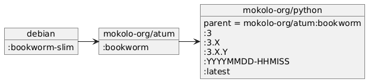

# Docker image mokolo-org/python:3

Base Docker image for Python3 projects

## Inheritance

Timestamp of creation and Python major version,
minor version and full version
are available as tags.

Examples:

- 20241110-183844
- :3
- :3.11
- :3.11.2

## Build image

Use command `make build` to build the image.

## Build images in doc/

See [mokolo-org/atum-bookworm](https://github.com/fredvos/atum-bookworm?tab=readme-ov-file#build-images-in-doc)
